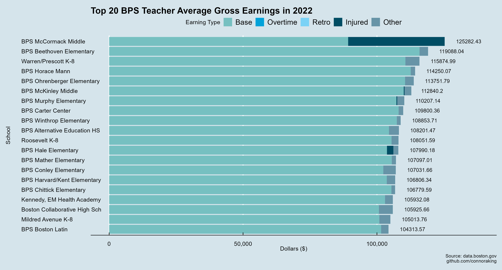
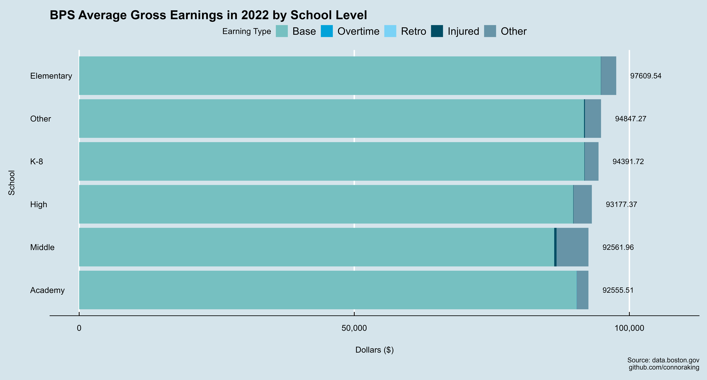
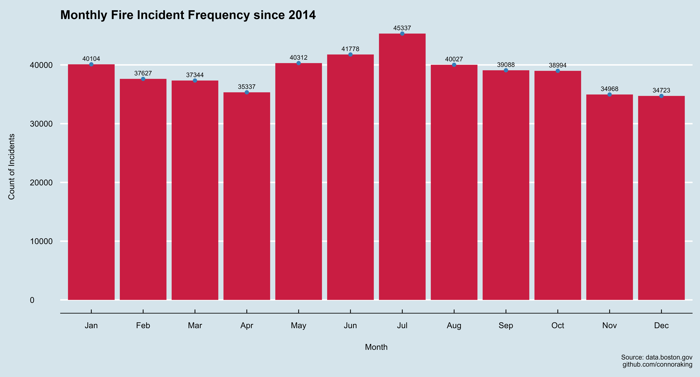

# Boston Public Data Analysis
Analyzing and creating data visualizations on public Boston Data from [data.boston.gov](data.boston.gov)

## Table of Contents

1. [Department Earnings](#department-earnings)
    - [2022](#2022)
    - [Throughout the Years](#throughout-the-years)
    - [Analytical Insights](#analytical-insights)
2. [Boston Public Schools Earnings](#boston-public-schools-Earnings)
    - [Teacher Earning Distribution](#teacher-earning-distribution)
3. [Fire Incidents](#fire-incidents)

## Department Earnings

Using datasets from these [earning reports](https://data.boston.gov/dataset/employee-earnings-report)

### 2022

<!-- -->

### _Data breakdown_

#### Overall Earnings
- The Boston Fire Department has the highest average gross earnings for 2022 at $157,168.68.
- The Strategy Department has the lowest average gross earnings at $64,350.30.

#### Base Salary
- The Boston Fire Department has the highest average base salary of $114,767.73.
- The Parks Department has the lowest average base salary of $47,775.02.

#### Overtime

- The Boston Police Department has the highest average overtime earnings at $25,745.20.
- The Environment and Strategy Departments have virtually no overtime earnings.

#### Injury Pay

- Both Boston Police Department and Boston Fire Department have considerable injury pay, with the Fire Department leading at $8,310.33.
- Several departments, including the Auditing, Public Facilities, Environment, Strategy, and Law Departments, have no injury pay.

#### Education Incentive

- The Boston Police Department is primarily the only department to earn education incentive payments with an average of $9,230.27.
- From [mass.edu](https://www.mass.edu/osfa/initiatives/pcipp.asp): "The Police Career Incentive Pay Program, also known as the Quinn Bill, was enacted by the Massachusetts Legislature to encourage police officers to earn degrees in law enforcement and criminal justice.  It provides educational incentives for regular full-time officers in participating cities and towns through salary increases."

#### Other

- The Strategy Department has the highest average other earnings at $9,394.63.
- The Public Works Department has the least in this category at $1,782.80.

### Throughout the Years

*Note: this line graph only includes departments that had continious earnings data since 2011 as some departments had data on some years and none within the others. They were omitted for visualization and analysis purposes.*

<!-- -->

#### _Key Observations_

- **High Grossing Departments:** The Boston Fire Department and the Boston Police Department consistently have higher average gross earnings compared to other departments. This is likely due to the nature of their roles, risks involved, and possible overtime or special duty allowances. They were seemingly on par with each other until the Fire Department saw a large increase from 2018-2019. There could be several reasons behind this spike such as contraction negotiations and retroactive pay. The City of Boston and its unions, including the fire department's union, have had a history of protracted negotiations, which sometimes led to such retroactive payouts. Specific records from the Boston Fire Department, the City of Boston's official statements, or union announcements from that time frame would lead to further definitive analysis behind the hike. 
- **Steady Growth:** Almost all departments have seen growth in their average gross earnings over the 12-year period. This could be due to annual raises, inflation adjustments, or an increased focus on specialized roles and responsibilities.
- **Fluctuations:** Some departments like the Environment Department and Parks Department have seen fluctuations in their earnings, indicating possible changes in department size, roles, or budget allocations.

### Analytical Insights

#### Yearly Growth Rate
- The Boston Fire Department saw a significant increase in average total gross earnings from 2018 to 2019. Such a spike may suggest back pay or adjustments due to a contract settlement. Knowing this, if a department is in prolonged negotiations, it might be prudent to budget for potential retroactive payments.
- The Boston Police Department's average total gross earnings have seen a consistent rise over the years, indicating potential regular increments, or increasing overtime and detail work.
- The Auditing Department and the Law Department both saw noticeable increases in 2022. Such trends might indicate increased workloads or other factors that necessitate a review of resource allocation.

#### Discrepancies in Earnings Components:
- Overtime stands out for the Boston Police and Fire Departments. High overtime suggests staffing might not be adequate to handle the demand, leading to employees working extended hours. Properly budgeting for recruitment and training might reduce long-term overtime costs.
- The Education Incentive is particularly significant for the Police Department, which suggests that there might be a large number of officers taking advantage of educational programs. If education correlates with better performance or reduced liabilities, increasing educational opportunities might be a strategic investment.

#### Comparative Department Analysis:
- Certain departments, like the Boston Fire and Police Departments, have much higher average total gross earnings than others, like the Parks Department or Environment Department. While some of this discrepancy is understandable given the nature of the roles, it's essential to ensure that all departments have adequate resources to fulfill their missions efficiently.

In summary, resource allocation should consider the unique needs and trends of each department. The data suggests potential areas of focus, including addressing high overtime costs, ensuring all departments have the resources they need, and optimizing incentive programs to ensure they're achieving desired outcomes. Properly analyzing these trends and acting on the insights can lead to more efficient use of city resources.

## Boston Public Schools Earnings

Since the Boston Public Schools Department (BPS) has a much more electic range of types of careers with different corresponding salaries, I decided to analyze them separately and focus on teacher earnings. The earning types were the same as the department earnings types (Base, Overtime, Retro, Injured, Other)

### Teacher Earning Distribution

<!-- -->

#### Central Tendency

- Mean (`$95,095.10`): The average earnings of the teachers.
- Median (`106,015.23): The earnings when all earnings are sorted in increaseing or decreasing order.
- Skewness: We can clearly see that the distribution is *left skewed* and because the median is greater than the mean.

<!-- -->

<!-- -->

<!-- -->

<!-- -->

<!-- -->

<!-- -->

## Fire Incidents

Using the dataset from these [fire reports](https://data.boston.gov/dataset/fire-incident-reporting)

<!-- -->

<!-- -->

<!-- -->

<!-- -->

<!-- -->

<!-- -->

