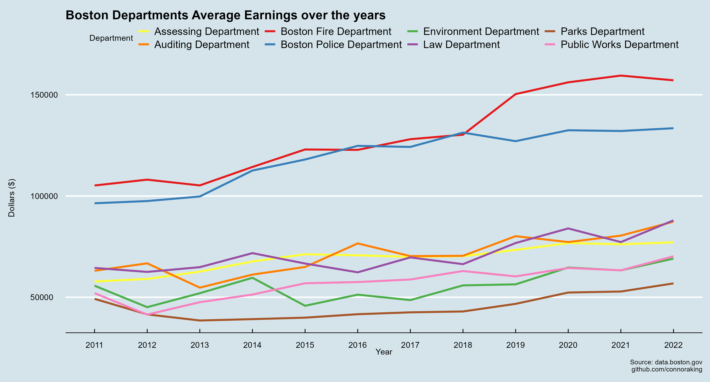

# Boston Public Data Analysis
Analyzing and creating data visualizations on public Boston Data from [data.boston.gov](data.boston.gov)

## Table of Contents

1. [Department Earnings](#department-earnings)
2. [Fire Incidents](#fire-incidents)

## Department Earnings

Using datasets from [earning reports](https://data.boston.gov/dataset/employee-earnings-report)
 
<!-- -->

<!-- -->

## Fire Incidents

<!-- -->

<!-- -->

<!-- -->

<!-- -->

<!-- -->

<!-- -->
