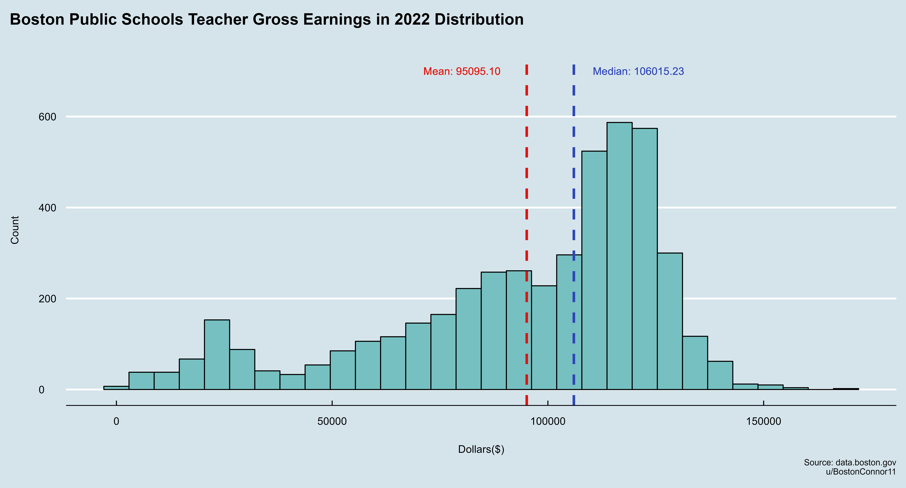
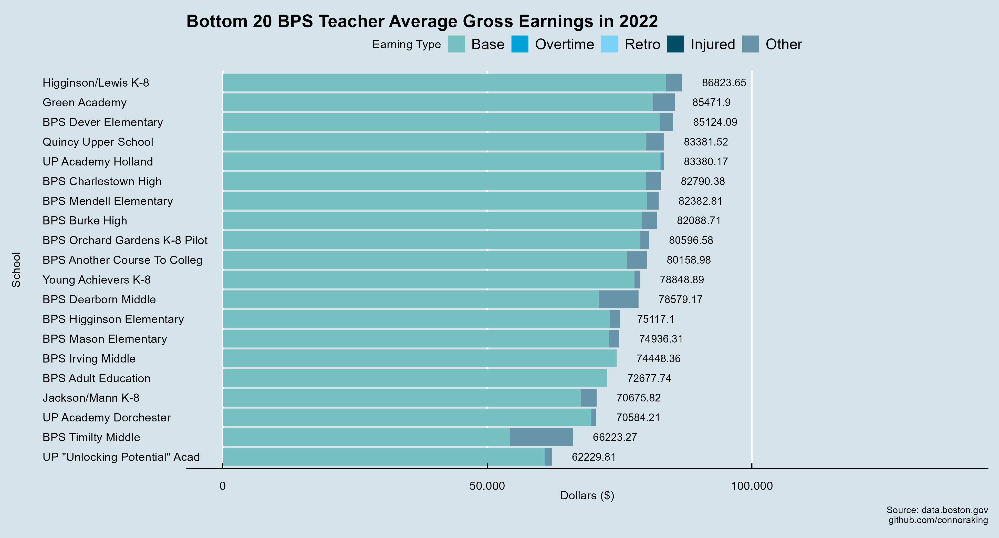
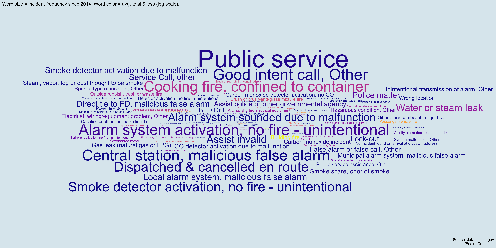

# Boston Public Data Analysis
Analyzing and creating data visualizations on public Boston Data from [data.boston.gov](https://data.boston.gov). This project serves to aid public resource allocation and infrastructure. The project primarily utilized `R` for statistical analysis and visualzation and involved using `SQL` to calculate various statistics.

R packages utilized: `dplyr`, `sf`, `ggplot2`, `viridis`, `ggthemes`, `ggrepel`, and `ggwordcloud`

## Table of Contents

1. [Department Earnings](#department-earnings)
    - [2022](#2022)
    - [Throughout the Years](#throughout-the-years)
    - [Department Analytical Insights](#department-analytical-insights)
2. [Boston Public Schools Earnings](#boston-public-schools-Earnings)
    - [Teacher Earning Distribution](#teacher-earning-distribution)
    - [Zipcode Map](#zipcode-map)
    - [Top 20 Schools](#top-20-schools)
    - [Bottom 20 Schools](#bottom-20-schools)
    - [School Level Earnings](#school-level-earnings)
    - [BPS Analytical Insights](#bps-analytical-insights)
3. [Fire Incidents](#fire-incidents)
    - [Incidents Since 2014](#incidents-since-2014)
    - [Incidents Map](#incidents-map)
    - [Word Clouds](#word-clouds)
    - [Fire Related Analytical Insights](#fire-related-analytical-insights)

## Department Earnings

Using datasets from these [earning reports](https://data.boston.gov/dataset/employee-earnings-report)

### 2022

<!-- -->

### Data Breakdown

#### Overall Earnings
- The Boston Fire Department has the highest average gross earnings for 2022 at *$157,168.68*.
- The Strategy Department has the lowest average gross earnings at *$64,350.30*.

#### Base Salary
- The Boston Fire Department has the highest average base salary of *$114,767.73*.
- The Parks Department has the lowest average base salary of *$47,775.02*.

#### Overtime

- The Boston Police Department has the highest average overtime earnings at *$25,745.20*.
- The Environment and Strategy Departments have virtually no overtime earnings.

#### Injury Pay

- Both Boston Police Department and Boston Fire Department have considerable injury pay, with the Fire Department leading at *$8,310.33*.
- Several departments, including the Auditing, Public Facilities, Environment, Strategy, and Law Departments, have no injury pay.

#### Education Incentive

- The Boston Police Department is primarily the only department to earn education incentive payments with an average of *$9,230.27*.
- From [mass.edu](https://www.mass.edu/osfa/initiatives/pcipp.asp): "The Police Career Incentive Pay Program, also known as the Quinn Bill, was enacted by the Massachusetts Legislature to encourage police officers to earn degrees in law enforcement and criminal justice.  It provides educational incentives for regular full-time officers in participating cities and towns through salary increases."

#### Other

- The Strategy Department has the highest average other earnings at *$9,394.63*.
- The Public Works Department has the least in this category at *$1,782.80*.

### Throughout the Years

*Note: this line graph only includes departments that had continious earnings data since 2011 as some departments had data on some years and none within the others. They were omitted for visualization and analysis purposes.*

<!-- -->

#### _Key Observations_

- **High Grossing Departments:** The Boston Fire Department and the Boston Police Department consistently have higher average gross earnings compared to other departments. This is likely due to the nature of their roles, risks involved, and possible overtime or special duty allowances. They were seemingly on par with each other until the Fire Department saw a large increase from 2018-2019. There could be several reasons behind this spike such as contraction negotiations and retroactive pay. The City of Boston and its unions, including the fire department's union, have had a history of protracted negotiations, which sometimes led to such retroactive payouts. Specific records from the Boston Fire Department, the City of Boston's official statements, or union announcements from that time frame would lead to further definitive analysis behind the hike. 
- **Steady Growth:** Almost all departments have seen growth in their average gross earnings over the 12-year period. This could be due to annual raises, inflation adjustments, or an increased focus on specialized roles and responsibilities.
- **Fluctuations:** Some departments like the Environment Department and Parks Department have seen fluctuations in their earnings, indicating possible changes in department size, roles, or budget allocations.

### Department Analytical Insights

#### Yearly Growth Rate
- The Boston Fire Department saw a significant increase in average total gross earnings from 2018 to 2019. Such a spike may suggest back pay or adjustments due to a contract settlement. Knowing this, if a department is in prolonged negotiations, it might be prudent to budget for potential retroactive payments.
- The Boston Police Department's average total gross earnings have seen a consistent rise over the years, indicating potential regular increments, or increasing overtime and detail work.
- The Auditing Department and the Law Department both saw noticeable increases in 2022. Such trends might indicate increased workloads or other factors that necessitate a review of resource allocation.

#### Discrepancies in Earnings Components:
- Overtime stands out for the Boston Police and Fire Departments. High overtime suggests staffing might not be adequate to handle the demand, leading to employees working extended hours. Properly budgeting for recruitment and training might reduce long-term overtime costs.
- The Education Incentive is particularly significant for the Police Department, which suggests that there might be a large number of officers taking advantage of educational programs. If education correlates with better performance or reduced liabilities, increasing educational opportunities might be a strategic investment.

#### Comparative Department Analysis:
- Certain departments, like the Boston Fire and Police Departments, have much higher average total gross earnings than others, like the Parks Department or Environment Department. While some of this discrepancy is understandable given the nature of the roles, it's essential to ensure that all departments have adequate resources to fulfill their missions efficiently.

In summary, resource allocation should consider the unique needs and trends of each department. The data suggests potential areas of focus, including addressing high overtime costs, ensuring all departments have the resources they need, and optimizing incentive programs to ensure they're achieving desired outcomes. Properly analyzing these trends and acting on the insights can lead to more efficient use of city resources.

## Boston Public Schools Earnings

Since the Boston Public Schools Department (BPS) has a much more electic range of types of careers with different corresponding salaries, I decided to analyze them separately and focus on teacher earnings. The earning types were the same as the department earnings types (Base, Overtime, Retro, Injured, Other). The data was messy and required a lot of wrangling and correcting. 

BPS use a step-and-lane salary schedule for teachers. Each *step* corresponds to on year of teacher experience. Lanes represent educational attainment. For example, there are separate lanes for teachers with bachelor's degrees compared to those with master's degrees. 

### Teacher Earning Distribution

<!-- -->

#### Central Tendency

- Mean (*$95,095.10*): The average earnings of the teachers.
- Median (*106,015.23*): The earnings when all earnings are sorted in increaseing or decreasing order.
- Skewness: We can clearly see that the distribution is *left skewed* and because the median is greater than the mean.

#### Interpretation

- A significant number of teachers earn notably higher than the mean which pulls the median higher.
- Since it is left-skewed, there appears to be more experienced teachers and there appears to be teachers earning significantly less which may indicate being newer.
- BPS teachers earn significantly more than the average public school teacher salary of *$66,397*.

### Zipcode Map

<!-- -->

#### Data Breakdown

- Zipcode `02134` (north west) has the lowest average total earnings of *$63,853.46*.
- Zipcode `02467` (small western bits) has the highest average total earnings of *$102,780,80*.

#### Implications  

- This map serves as a proxy for the average number of years teaching for each zip code because of the step-and-lane salary system.
- The BPS could utilize this map to distribute the experience level of teachers more evenly. The southern zip codes seem to have more experienced teachers with higher earnings.  

### Top 20 Schools

<!-- -->

- McCormack Middle has a glaring anomaly of `Injured` pay. They pay an average `Injured` pay of *$36,035.48*. This is almost 33k more than the second highest Injured pay average. Upon analyzing the data, there doesn't seem to be any outliers skewing the average. Searching the internet didn't return anything explanatory either. I'm left to infer that something went wrong in data collection or some administrative pecularity. BPS should investigate this further. 

### Bottom 20 Schools

<!-- -->

- In-district charter schools seem to earn less.

### All Schools

<!-- -->

### School Level Earnings

#### Stacked Bar Chart

<!-- -->

- The earnings between school levels seem to be rather close on average.
- Elementary school teachers earn the most at an average of *$97,609.54*
- Academy school teachers earn the least at an average of *$92,555.51*
- Middle school teachers have a higher amount of `Injured` earnings *$431.52* which is almost 300 more than the second highest average.

#### Violin Plot

<!-- -->

- Every distribution is skewed left.
- Elementary schools seem to have the largest `mode` while middle schools seem to have the smallest `mode`. 

### BPS Analytical Insights 

1. Geographical Disparities
  The earnings distribution across zip codes can help BPS understand where more experienced teachers are located. This could be used for strategic recruitment, especially if BPS wants to balance out the experience distribution. Furthermore, understanding why certain zip codes have higher average earnings can offer insights into possible location-based incentives or benefits.  
2. Data Collection 
    - The unusual `Injured` pay at McCormack Middle is concerning and suggests either a data issue or perhaps an operational challenge. It's essential for BPS to understand the reason behind this anomaly to ensure that resources are being allocated appropriately and to avoid potential reputational risks.
    - The data needed thorough cleaning as many zip codes were wrong and schools that had been shut down were included. A possible culprit could be a teacher transitioning to a different school.
3. Earnings Across Levels
   - While the earnings between school levels are relatively close, the nuances such as the higher `Injured` earnings for middle school teachers can be crucial for resource planning. It might be worthwhile for BPS to probe deeper into the reasons behind this pattern. Is there something about the middle school environment or curriculum that makes injuries more frequent?

## Fire Incidents

Using the dataset from these [fire reports](https://data.boston.gov/dataset/fire-incident-reporting).

Since the Boston Fire Department has the [highest earnings](#2022), I decided to visualize and analyze fire incidents since 2014 within Boston. 

### Incidents Since 2014

#### Yearly

<!-- -->

- Incidents are at an all time high and growing at *54,663* incidents in 2022.
- There was a dip in 2020 which can be explained by the COVID lockdowns.

#### Monthly

<!-- -->

- Fire incidents by months heavily correlates with average monthly precipitation. 

#### Hourly

<!-- -->

- Most fire incidents occured during the middle of the day.
- 4:00am to 5:00am had the lowest count of 7,853 incidents
- 11am to 12pm had the highest count of 28,230 incidents

### Incidents Map

*note: the incidents dataset had a neighborhood of just "Boston" and was missing some neighborhoods. Upon investigating the streets, it seems that this "Boston" neighborhood was an aggregate of the missing neighborhoods which I labeled "Inner Boston"*

<!-- -->

<!-- -->

These maps showcase the amount of fire incidents in 2014 in each neighborhood. These maps can help urban development of new fire stations. It appears that Roxbury could benefit from additional fire stations.

### Word Clouds

<!-- -->

- This word cloud helps visualize fire incident by description and their corresponding monetary loss (damage) suffered.
- *Public service* was the most frequent incident at a count of 77,860 and an average loss of only 30 cents.
- The highest total monetary loss average were **Water vehicle fire** at *$128,276* and **Building fire** at *$106,104*
- There were 465,639 incidents since 2014 but only 13,028 incurred any monetary loss which means 97.2% of incidents didn't have any monetary damage.

<!-- -->

- This word cloud helps visualize fire incidents by property description and their corresponding monteary loss suffered.
- The most frequent property were **Multifamily dwellings** with an average total loss of *$2,093.85*
- The highest average total loss were **Casinos** at *$50,000*

### Fire Related Analytical Insights

1. Increasing Trend of Fire Incidents
    - The data shows an upward trend in fire incidents, reaching an all-time high in 2022. Despite the Boston Fire Department having the highest average earnings, the surge in incidents suggests a mounting pressure on the department's resources and personnel. Efficient resource allocation, strategic station placements, and preventive measures are crucial.
2. Influence of External Factors
    - The dip in incidents during 2020, presumably due to the COVID lockdowns, emphasizes the role external societal factors play in incident frequencies.
    - Similarly, the correlation of incidents with monthly precipitation might be indicative of the various challenges faced by the department throughout the year.
3. Time-based patterns
    - The trend of most incidents occurring during mid-day could be attributed to heightened human activity during these hours, possibly leading to more accident-prone situations. Conversely, the low incidents during the early morning might be due to reduced activity.
4. Geographical Discrepancies
    - The "Inner Boston" categorization emphasizes the importance of meticulous data analysis to gain accurate insights. Using such approaches can uncover hidden patterns or information gaps. The notable number of incidents in Roxbury reinforces the idea that certain neighborhoods may be in urgent need of additional fire station resources.
5. Incident Descriptions and Monetary Impact
    - While **Public service** incidents are frequent, they result in minimal monetary damage, highlighting that not all incidents strain financial resources. However, specific incidents like **Water vehicle fire** and **Building fire** lead to considerable monetary losses, indicating areas where preventive measures can lead to significant cost savings.
6. Property-based Incident Insights
    - The high frequency of incidents in **Multifamily dwellings** underscores the need for fire safety awareness and measures in residential complexes. While properties like **Casinos** had the highest average total loss, their overall frequency might be low, leading to a skewed perception of risk. It's essential to consider both frequency and monetary impact to prioritize fire safety initiatives.
7. Relevance to Boston Fire Department Earnings
    - The department's high earnings could be justified by sheer volume and variety of incidents they deal with. However, the emphasis should be on ensuring that these resources are translated into effective firefighting stratetgies and allocation. For instance a firetruck would not be needed at most **Public Service** incidents since they only have a total average loss of 30 cents. 

